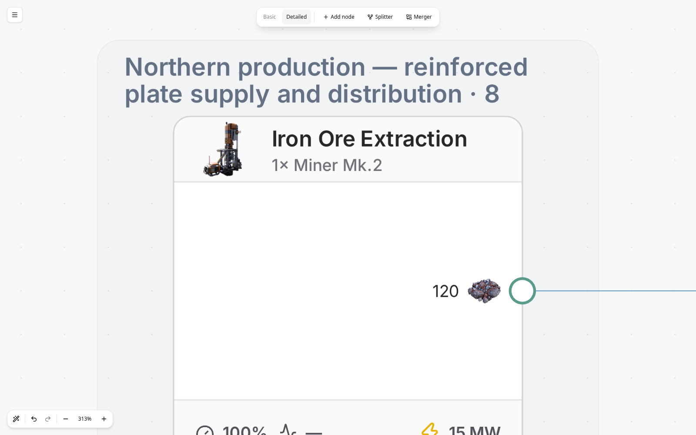

# Production stages and logistics areas

Auto-arrange and Detailed conversion use the same layout. Recipes form vertical
stacks; parallel steps occupy the same production stage. Physical logistics sit
between stages, aligned with their connected machine ports. The diagram stays on one editable canvas.
Group labels, outlines, header selection, and renaming are shown only in Detailed
mode; Basic mode shows its recipe cards directly.

These screenshots are from the actual browser conversion workflow: 10 Modular
Frames/min, Cast Screws, and Mk.1 belts.

The larger Detailed fixture shows the logistics columns before and after the
Cast Screw constructor stack, with separate feeds and space between the groups.

## Layout rules

- Group machines by recipe, preserving individual cards and machine port order.
- Two-way splitter outputs and merger inputs occupy the top and bottom slots,
  leaving the center unused. Generation and Auto-arrange set presentation order;
  actual port identities, smart rules, priorities, and rates stay unchanged.
- Group connected routers and parallel supply groups serving the same recipe
  port. Capacity limits still describe separate physical belts.
- Keep every logistics group in its own non-overlapping area between recipe
  groups. Routers at the same forward depth occupy one column; later steps are
  strictly to the right. Recipe stacks and logistics areas never interleave.
- Size local layout guides using the complete neighboring recipe stacks and
  their real port heights. This preserves vertical space for separate branches
  instead of compressing all boundary connections into one short row of ports.
- Arrange group areas by production stage, with fixed recipe stacks. After group
  placement, route connections through free corridors between actual ports.
  Routing obstacles follow visible group bounds, not the unused guide space.
- Preserve ELK's separate corridor lanes as candidates. In two deterministic
  sweeps, rank clear routes by overlapping belt length, crossings, bends, and
  finally length. The final route never has to visit a prescribed boundary exit.
  Longer bypasses can stay outside unrelated groups. This is a bounded heuristic,
  not a claim that every factory has a crossing-free layout.
- Identify cycles from topology, then recognize return distributors feeding
  parallel branches. Put routers serving only returns below the forward flow.
  Give return links separate lanes, rounded dashes, and the existing flow colors.
  Feeds leaving a return distributor travel horizontally at their port heights
  before turning toward their destinations. Other returns choose nearby clear
  paths around their connected routers. Candidate paths avoid overlaps and weigh
  length against bends and crossings; unrelated branches below a loop do not force
  it down to the bottom of the entire group.
- Include internal logistics routes in group bounds, with equal 56px padding on
  every side. External feeds do not enlarge those bounds. The same bounds reserve
  layout space, draw outlines, and keep unrelated bypass belts out.
- Keep cycles between production recipes within a finite stage. Long forward
  bypasses stay solid even if their geometry travels leftward.
- Persist positions and routes through the existing save format. Feedback roles
  and default group labels are derived; custom names are saved. Editing a cycle updates its styling and
  manual moves cannot leave stale saved group boundaries.

The implementation changes presentation only. It does not replace belts,
rebalance rates, change machine clocks, or insert/remove physical routers.
Existing plans adopt it on their next Auto-arrange, which remains undoable.

## Group labels and selection

Group headers use a fixed 18px canvas font size at every zoom. Labels use up to
two lines and truncate to fit the header width; zoom never changes their text,
font size, wrapping, or visibility. Text texture resolution increases with zoom
and display density to keep lettering sharp. Hovering reveals the full name.

Click a header to select its nodes and open the group inspector. Rename or reset
the group there; names persist in Basic and Detailed saves and through subsequent
Auto-arrange, with undo/redo support. Clicking a member card inspects that node;
dragging a selected member moves the group. Thin outlines mark group boundaries,
with a stronger outline for the selected group. Link strokes are thinner while
preserving their capacity colors, dashed return style, and click targets.

Basic mode keeps the arranged cards and connections without group decorations.

The mobile build toolbar uses a mode menu, Add node, and a menu with labeled
Splitter and Merger actions. It stays on one row at 320–412px widths.

Muted ports retain their colored ring and neutral center. The ring and center
are drawn separately so reducing opacity cannot expose a colored disk beneath
the center.

