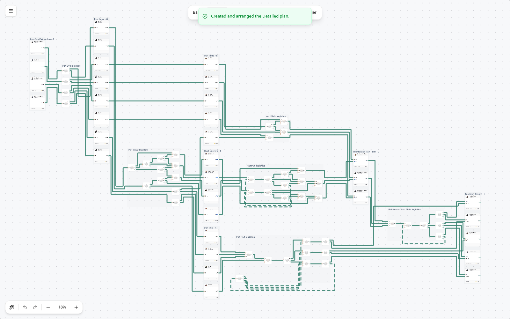
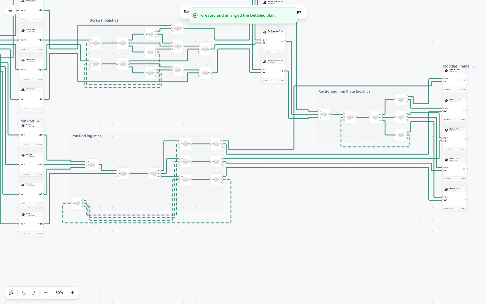

# Production stages and logistics areas

Auto-arrange and Detailed conversion use the same layout. Recipes form vertical
stacks; parallel steps occupy the same production stage. Physical logistics sit
in their own areas between stages. The diagram stays on one editable canvas.

These screenshots are from the actual browser conversion workflow: 10 Modular
Frames/min, Cast Screws, and Mk.1 belts.

## Layout rules

- Group machines by recipe, preserving individual cards and port order.
- Group connected routers and parallel supply groups serving the same recipe
  port. Capacity limits still describe separate physical belts.
- Lay out each logistics area with fixed boundary ports, then arrange those
  areas between production stages. Join the internal and external routes at
  their boundary ports. No synthetic boundary nodes enter the saved plan.
- Identify cycles from topology, then recognize return distributors feeding
  parallel branches. Put routers serving only returns below the forward flow.
  Give return links separate lanes, rounded dashes, and the existing flow colors.
- Keep cycles between production recipes within a finite stage. Long forward
  bypasses stay solid even if their geometry travels leftward.
- Persist positions and routes through the existing save format. Feedback roles
  and group labels are derived, so editing a cycle updates its styling and
  manual moves cannot leave stale saved group boundaries.

The implementation changes presentation only. It does not replace belts,
rebalance rates, change machine clocks, or insert/remove physical routers.
Existing plans adopt it on their next Auto-arrange, which remains undoable.
