# Production stages and logistics areas

Auto-arrange and Detailed conversion use the same layout. Recipes form vertical
stacks; parallel steps occupy the same production stage. Physical logistics sit
between stages, aligned with their connected machine ports. The diagram stays on one editable canvas.
Group outlines, inspect icons, summaries, and renaming are shown only in Detailed
mode; Basic mode shows its recipe cards directly. Basic routes around visible
node cards, without the hidden group boundaries or side-entry constraints used
by Detailed. Open corridors stay direct, including shared-output branches.

These screenshots are from the actual browser conversion workflow: 10 Modular
Frames/min, Cast Screws, and Mk.1 belts.

The larger Detailed fixture shows the logistics columns before and after the
Cast Screw constructor stack, with separate feeds and space between the groups.

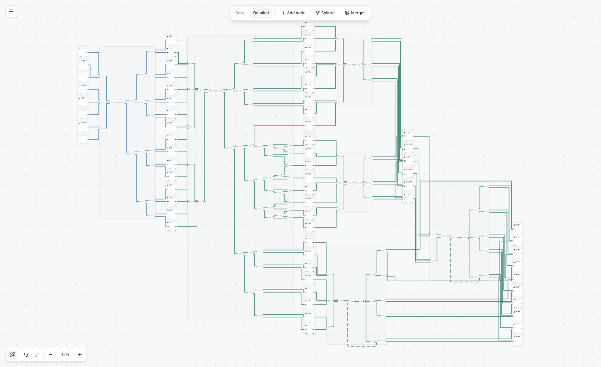

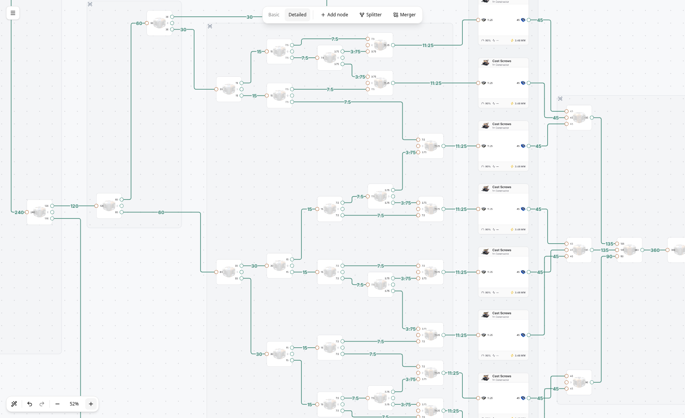

## Destination logistics groups

Ingot distribution is now separated by the recipes it supplies. The same
10-Modular-Frames/min example has an 11-router screw supply group and a 27-router
plate supply group, each including its connected shared splitter. Those splitters'
rod branches leave their host groups normally. The remaining standalone rod
splitter has no router connection to either larger balancer. All 39 physical
routers and their connections are preserved.

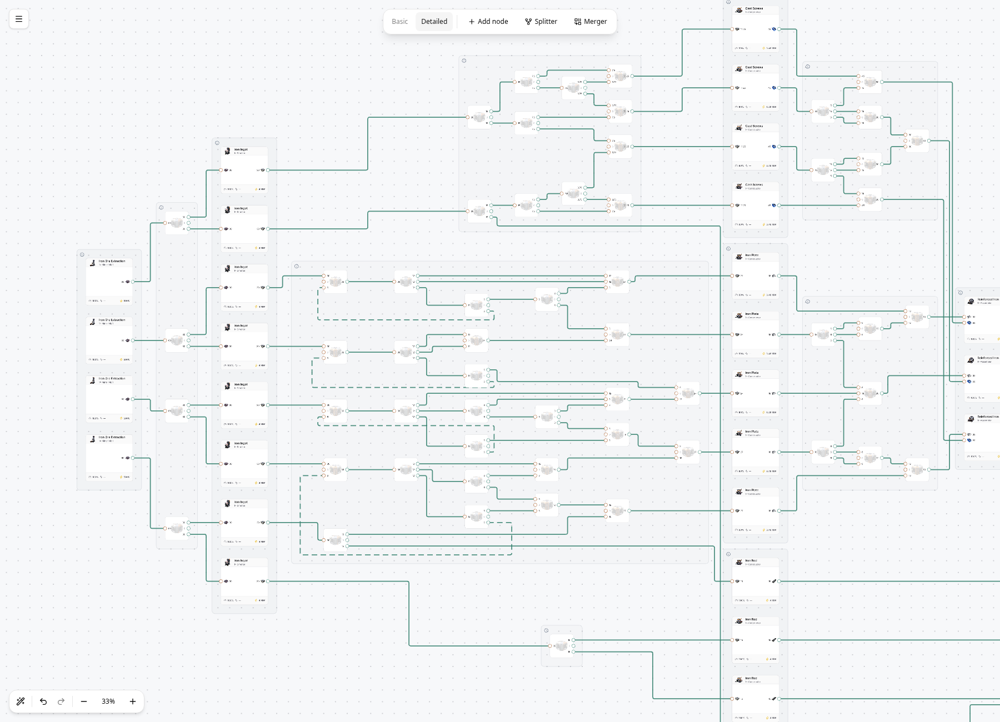

## Layout rules

- Group machines by recipe, preserving individual cards and machine port order.
- Two-way splitter outputs and merger inputs occupy the top and bottom slots,
  leaving the center unused. Generation and Auto-arrange set presentation order;
  actual port identities, smart rules, priorities, and rates stay unchanged.
- Group routers by the next recipe inputs they supply. Parallel supplies with
  the same destinations stay together; sharing a producer recipe alone does not
  join them. Lone routers join a directly connected larger logistics group,
  preferring the strongest connection, then larger group size and stable ID.
  Other branches can leave the host group without merging their destination
  groups. Absorption preserves the host's name and identity, and cannot create
  a cycle between group areas. Larger shared networks keep their own groups.
  Complete feedback paths stay in one group. The inspector identifies the main
  destination recipe or shared distribution. Capacity limits still describe
  separate physical belts.
- Keep every logistics group in its own non-overlapping area between recipe
  groups. Routers at the same forward depth occupy one column; later steps are
  strictly to the right. Recipe stacks and logistics areas never interleave.
- Size local layout guides using the complete neighboring recipe stacks and
  their real port heights. This preserves vertical space for separate branches
  instead of compressing all boundary connections into one short row of ports.
- Lay out destination balancers before their upstream shared distribution so
  their port heights guide the connecting branches. Guides influence placement
  without reserving empty space beyond the visible group contents.
- Arrange group areas by production stage, with fixed recipe stacks. Additional
  logistics groups do not stagger recipes belonging to the same production stage. After group
  placement, route connections through free corridors between actual ports.
  Routing obstacles follow visible group bounds, not the unused guide space.
- Preserve ELK's separate corridor lanes as candidates. Routes use the 16px
  snapping grid, a 32px preferred parallel gap, and a 16px minimum. Only the
  first/last 32px at a fixed port are exempt. After initial routing, deterministic
  lane adjustments prioritize overlap and minimum-gap violations, then crossings,
  preferred spacing, bends, and length. This applies inside logistics areas,
  between groups, and to feedback returns. Fixed endpoints stay attached.
- ELK reserves 32px lane gaps initially. If final routes still violate the
  minimum, retry with larger corridor/lane spacing (up to four layouts). Apply
  only a layout that passes the minimum-gap check. Connections cross only the straight left/right sides of a box, clearing its
  16px rounded corners. Source and destination top/bottom boundaries are routing
  barriers, including during lane-spacing adjustments. Vertical runs stay at least
  one grid cell (16px) from a box side; horizontal links can cross those sides. Longer bypasses can stay outside unrelated
  groups. Crossing reduction remains a bounded heuristic.
- Identify cycles from topology, then recognize return distributors feeding
  parallel branches. Put routers serving only returns below the forward flow.
  Give return links separate lanes, rounded dashes, and the existing flow colors.
  Feeds leaving a return distributor travel horizontally at their port heights
  before turning toward their destinations. Other returns choose nearby clear
  paths around their connected routers. Candidate paths avoid overlaps and weigh
  length against bends and crossings; unrelated branches below a loop do not force
  it down to the bottom of the entire group.
- Include internal logistics routes in group bounds, with at least 48px padding on
  every side, snapping all four edges outward to the 16px grid. External feeds do not enlarge those bounds. The same bounds reserve
  layout space, draw outlines, and keep unrelated bypass belts out.
- Keep cycles between production recipes within a finite stage. Long forward
  bypasses stay solid even if their geometry travels leftward.
- Persist positions and routes through the existing save format. Feedback roles
  and default group labels are derived; custom names are saved. Editing a cycle updates its styling and
  manual moves cannot leave stale saved group boundaries.

The implementation changes presentation only. It does not replace belts,
rebalance rates, change machine clocks, or insert/remove physical routers.
Existing plans adopt it on their next Auto-arrange, which remains undoable.

## Group inspection and selection

Each group has a Lucide Info icon in its upper-left corner, drawn as vector
paths so it stays sharp with zoom and display density. The 24px icon sits 16px
inside the group border. There is no canvas text
header. Hover reveals the group name; the click target remains usable when
zoomed out. Click the icon to select the members and open the group inspector.

Logistics summaries show incoming/outgoing rate multiplicities, totals by item with material icons, buildings, belts and pipes by tier, and
internal feedback return links. Balancer expressions use an inline Lucide
ArrowRight SVG. The balancer expression identifies remainder flow; output totals combine
destinations into one row per material. Internal recirculation is excluded from boundary throughput.
Unresolved flow remains explicitly unresolved.

Machine summaries show configured consumption and production (including products
without outgoing belts), clocks, power, and buildings. These inputs and outputs
appear once; the recipe name is repeated only when the group has a custom name.
Both group types retain a tier table without a separate connection summary;
production tables omit the internal column.
Rename or reset the group in the inspector; names persist through subsequent
Auto-arrange and support undo/redo. Clicking a member card inspects that node;
dragging a selected member moves the group. Thin outlines mark group boundaries,
with a stronger outline for the selected group. Link strokes preserve capacity
colors, dashed return style, and click targets. Link strokes, their selection
highlights, and connection previews scale with the canvas instead of keeping a
fixed screen thickness. At 100% zoom, normal links are 1.75px, selected links
2.5px with a 5px highlight, and previews 3px.

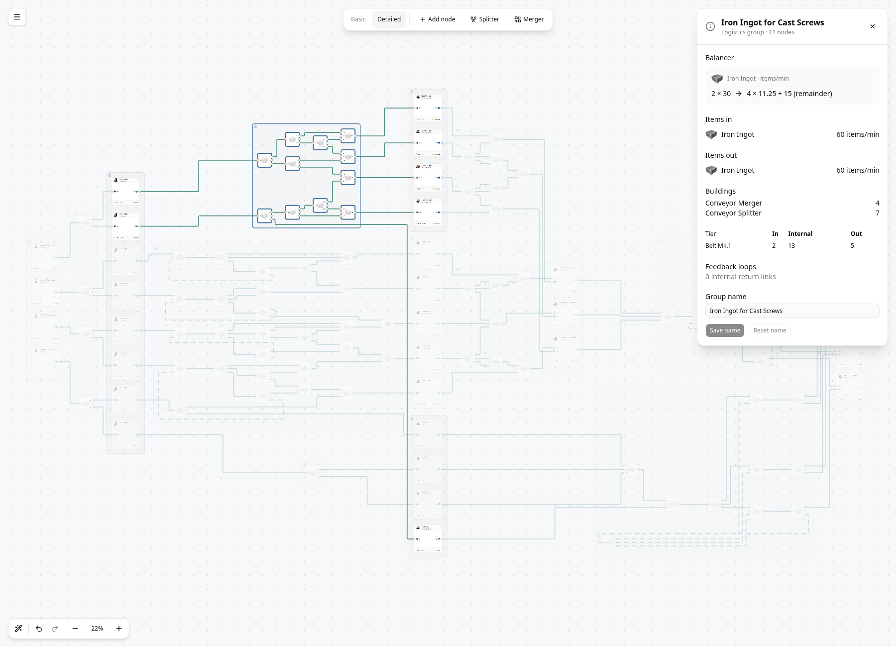

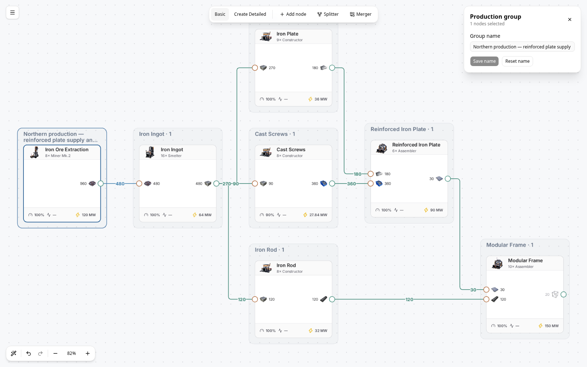

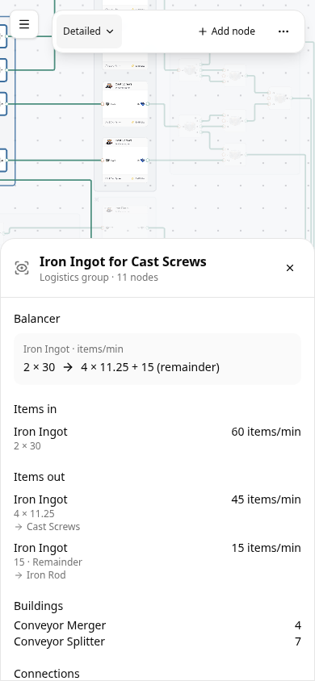

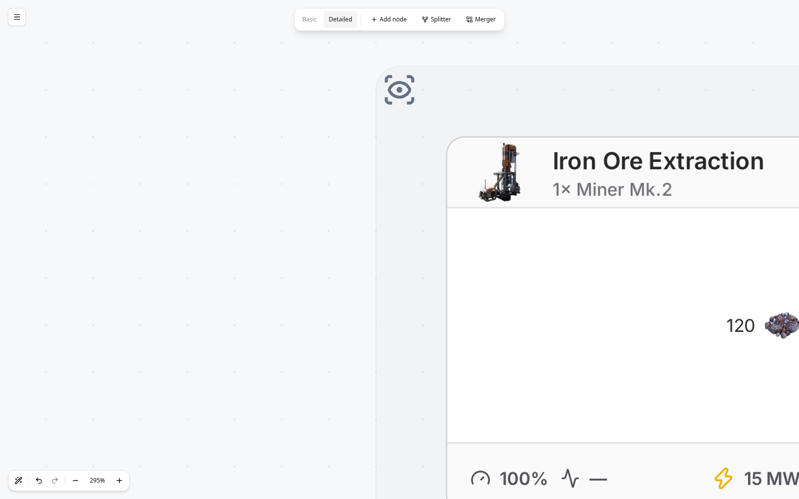

Basic mode keeps the arranged cards and connections without group decorations.

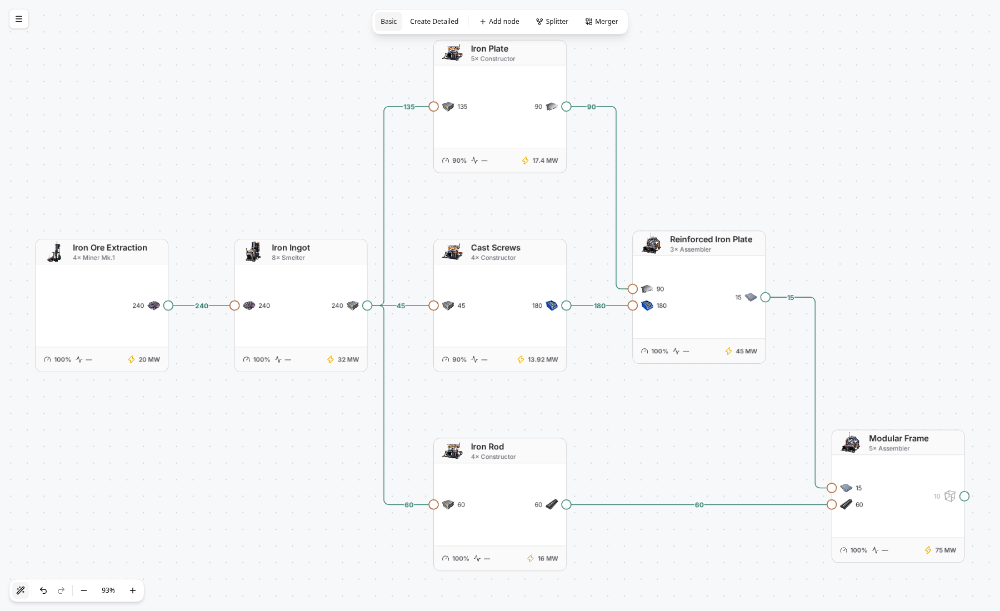

The mobile build toolbar uses a mode menu, Add node, and a menu with labeled
Splitter and Merger actions. It stays on one row at 320–412px widths.

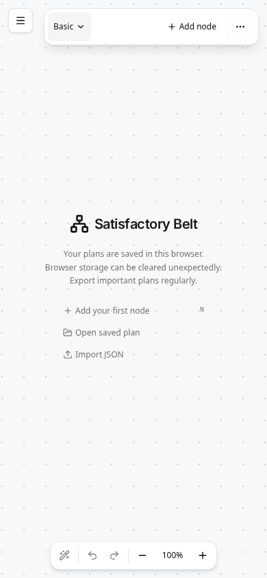

Muted ports retain their colored ring and neutral center. The ring and center
are drawn separately so reducing opacity cannot expose a colored disk beneath
the center.

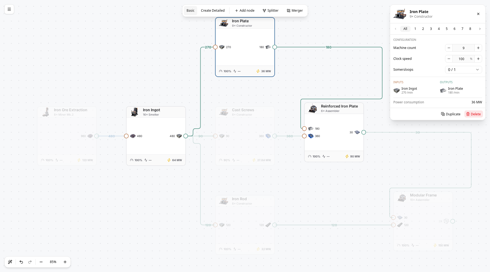

## Parallel link spacing

Grid-aligned parallel feeds around a Reinforced Iron Plate assembler. The same
spacing policy applies to local balancers and dashed return links. Existing
plans get the new spacing on their next Auto-arrange; manual route editing is
unchanged.

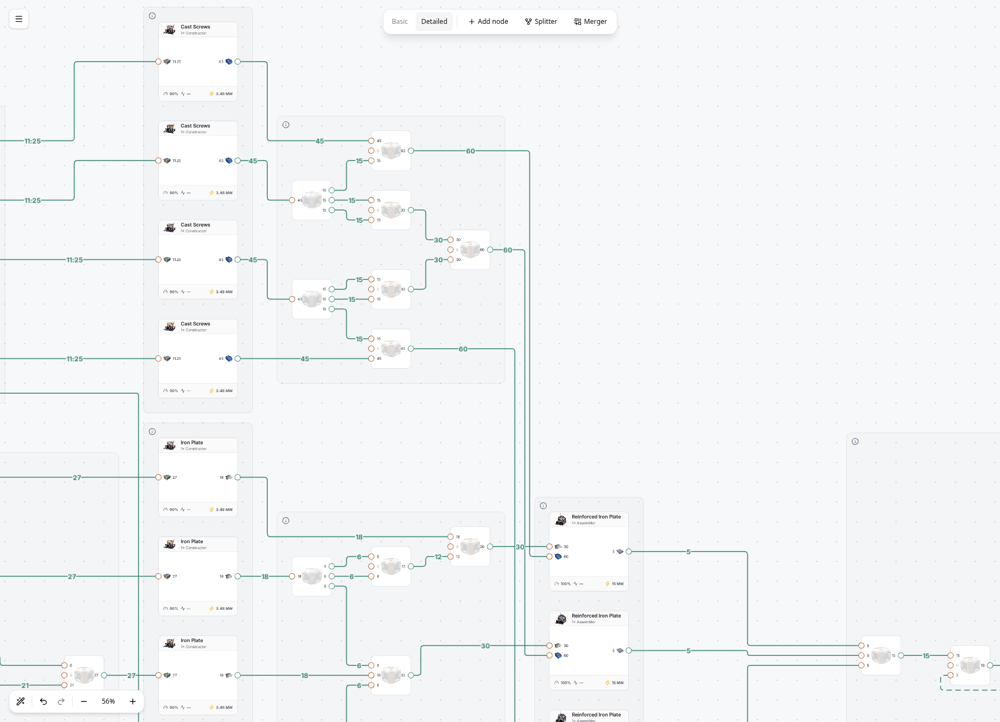
